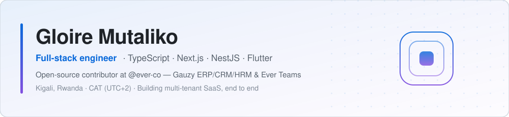

<div align="center">

<picture>
  <source media="(prefers-color-scheme: dark)" srcset="assets/banner/profile-banner-dark.svg">
  <source media="(prefers-color-scheme: light)" srcset="assets/banner/profile-banner-light.svg">
  
</picture>

**Full-stack engineer** · **TypeScript · Next.js · NestJS** · **Open source at [@ever-co](https://github.com/ever-co)**

Kigali, Rwanda (CAT, UTC+2) · Working in French and English

[Website](https://gloire-mutaliko.vercel.app/) ·
[Email](mailto:mufunyig@gmail.com) ·
[X](https://x.com/GloireMutaliko) ·
[LinkedIn](https://www.linkedin.com/in/gloire-mutaliko-2b6733211/)


</div>

---

## About

I build products end to end — schema, API, front end, and the delivery pipeline
under them — and I ship them as things you can open and read, not as claims.

Most of my work lives in the TypeScript ecosystem: **Next.js** on the product
side, **NestJS** and **Express** behind it, **PostgreSQL** and **Supabase**
underneath. Day to day that means multi-tenant SaaS in `pnpm` + **Turborepo**
monorepos, and open-source work on business platforms that thousands of teams
actually run.

I also carry the parts most job titles leave out: scoping with the client,
cutting the backlog, deciding what does **not** get built this month.

## Currently building

| | |
| --- | --- |
| 🧭 **Multi-tenant SaaS** | Travel and operations products — Next.js + Supabase, Turborepo monorepos, from first schema to production |
| 🔌 **Gauzy × Plane integration** | Building out the [ever-gauzy-plugins-plane](https://github.com/ever-co/ever-gauzy-plugins-plane) bridge: work items, cycles, modules, filtering |
| 🏢 **Ever Gauzy** | Feature and fix work on an open-source ERP/CRM/HRM platform used in production |
| 👥 **Ever Teams** | API and front-end work on the open work & productivity platform |
| 🧱 **Monorepo foundations** | pnpm workspaces, Turborepo pipelines and shared config — the layer that keeps five products shippable by a small team |
| 🧪 **NestJS foundations** | Auth, multi-ORM data access, and the boring plumbing that decides how fast year two goes |

## Open source

Public, reviewable work — every number below is a merged pull request count you
can verify on GitHub.

| Project | What it is | My contribution |
| --- | --- | --- |
| [ever-co/ever-gauzy](https://github.com/ever-co/ever-gauzy) | Open-source ERP / CRM / HRM / ATS platform (4.3k ★) | **92 merged PRs** — features and fixes across the platform |
| [ever-co/ever-teams](https://github.com/ever-co/ever-teams) | Open work & productivity platform (500+ ★) | **45 merged PRs** — API and front-end work |
| [ever-co/ever-gauzy-plugins-plane](https://github.com/ever-co/ever-gauzy-plugins-plane) | Gauzy ↔ Plane project-management integration | **140 merged PRs** — endpoints, filtering, request context, error propagation |

<sub>Roughly 280 pull requests to [@ever-co](https://github.com/ever-co) repositories to date.</sub>

## Engineering toolkit

### ⚛️ Product & front end

| | |
| --- | --- |
| Frameworks | Next.js (App Router), React |
| UI & styling | Tailwind CSS, shadcn/ui, Ant Design, Syncfusion, Figma hand-off |
| State & data | React Query, Redux Toolkit, Context API, Server Actions |
| Languages | TypeScript, JavaScript |

### ⚙️ Backend & APIs

| | |
| --- | --- |
| Node.js | NestJS, Express.js |
| Other runtimes | Java |
| API styles | REST, WebSockets, webhooks, third-party integrations |
| Auth | Auth.js / NextAuth custom adapters, JWT, OAuth, row-level security |

### 🗄️ Data

| | |
| --- | --- |
| Databases | PostgreSQL, MySQL, SQLite, Redis |
| Access layer | Prisma, TypeORM, Supabase client, raw SQL when it is the honest answer |

### ☁️ Delivery

| | |
| --- | --- |
| Platforms | Vercel, Supabase, Docker, Linux |
| CI/CD | GitHub Actions, preview deployments, Turborepo remote caching |
| Monorepo | pnpm workspaces, Turborepo, shared config packages |
| Tooling | Git, ESLint, Prettier, Postman, VS Code |

## How I work with AI

I use AI across the lifecycle — spec drafting, architecture options, review,
test generation, refactors — the same way I use a compiler or a profiler: it
removes the mechanical part, it does not remove the judgement. What ships is
what I have read and understood.

```text
Idea → Spec → Schema → API → UI → Review → Test → Deploy → Watch it in production
```

Where it earns its place: turning a client conversation into a written spec,
generating the first pass of a migration or a test suite, and reading a codebase
I did not write before I touch it. Where it does not: deciding what the product
should do.

## Three things I hold to

- **Ship something inspectable.** A repo, a preview URL, or an honest status
  update. Anything else is a promise.
- **Type the seams.** Most production incidents are contract bugs between two
  layers. TypeScript at the boundary is the cheapest insurance available.
- **Cut scope before quality.** A smaller thing that works beats a bigger thing
  that almost does — and the person maintaining it in a year is usually me.

## GitHub activity

<div align="center">

<!-- Metrics panel — uncomment once METRICS_TOKEN is set and .github/workflows/metrics.yml
     has run once, otherwise this renders as a broken image:

-->

<picture>
  <source media="(prefers-color-scheme: dark)" srcset="https://github-profile-summary-cards.vercel.app/api/cards/profile-details?username=GloireMutaliko21&theme=github_dark">
  
</picture>

<picture>
  <source media="(prefers-color-scheme: dark)" srcset="https://github-profile-summary-cards.vercel.app/api/cards/repos-per-language?username=GloireMutaliko21&theme=github_dark">
  
</picture>
<picture>
  <source media="(prefers-color-scheme: dark)" srcset="https://github-profile-summary-cards.vercel.app/api/cards/most-commit-language?username=GloireMutaliko21&theme=github_dark">
  
</picture>

<picture>
  <source media="(prefers-color-scheme: dark)" srcset="https://raw.githubusercontent.com/GloireMutaliko21/GloireMutaliko21/output/github-contribution-grid-snake-dark.svg">
  <source media="(prefers-color-scheme: light)" srcset="https://raw.githubusercontent.com/GloireMutaliko21/GloireMutaliko21/output/github-contribution-grid-snake.svg">
  
</picture>

</div>

## Get in touch

| Channel | Best for |
| --- | --- |
| 🌐 [gloire-mutaliko.vercel.app](https://gloire-mutaliko.vercel.app/) | Portfolio, selected projects, longer background |
| 📧 [mufunyig@gmail.com](mailto:mufunyig@gmail.com) | Project enquiries and anything needing a written reply |
| 💼 [LinkedIn](https://www.linkedin.com/in/gloire-mutaliko-2b6733211/) | Roles, introductions, hiring conversations |
| 🐦 [@GloireMutaliko](https://x.com/GloireMutaliko) | Short updates on what I am building |
| 💬 [Issues & PRs](https://github.com/GloireMutaliko21?tab=repositories) | Questions about the code itself |
| 📍 Kigali, Rwanda | CAT (UTC+2) — comfortable across European and African hours |

---

<div align="center">

### Building a product where the architecture matters as much as the feature list?

I take on full-stack work end to end — schema to shipped UI — and open-source
contributions where the codebase has to survive its second year.
The code is open: read it first, then [say hello](mailto:mufunyig@gmail.com).

</div>
